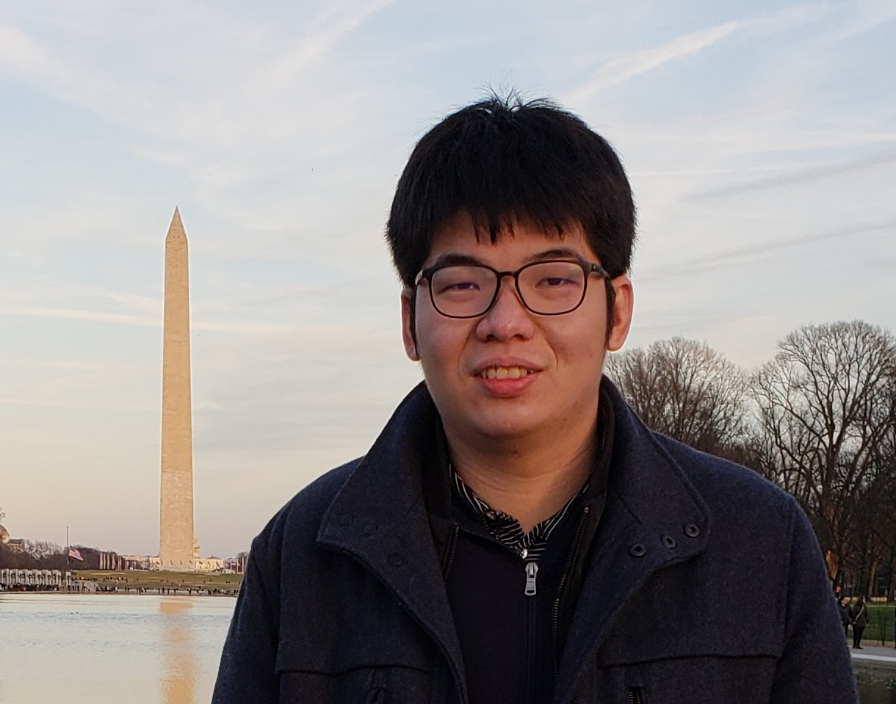

 <h1>Weiliang Tan</h1> 

Ph.D. Candidate in [Applied Economics at Cornell University](https://dyson.cornell.edu/)

Visiting Student in [Economics at Yale University](https://economics.yale.edu/)

<left>
My name is Weiliang Tan. I am a PhD Candidate in Applied Economics at Cornell University working with Prof. Ivan Rudik and Prof. Nancy Chau. I am currently a visiting student at the Department of Economics at Yale University, hosted by Prof. Samuel Kortum. For Spring and Fall 2022, I was a visiting student at the Department of Economics at UC Berkeley. 
<!-- I will be on the 2023-2024 job market. -->

My research focuses on the spatial and network aspects of innovation and climate change.
   

