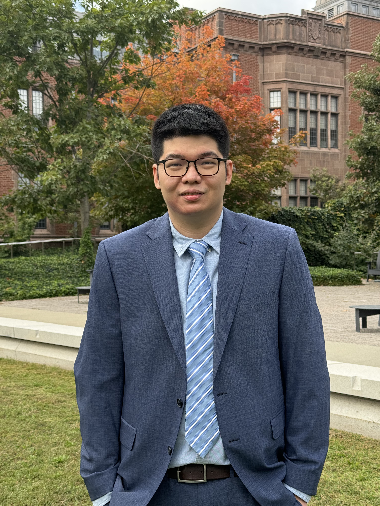

 <h1>Weiliang Tan</h1> 

Ph.D. Candidate in [Applied Economics at Cornell University](https://dyson.cornell.edu/)

Visiting Student in [Economics at University of California, Berkeley](https://www.econ.berkeley.edu/)

<left>
My name is Weiliang Tan. I am a PhD Candidate in Applied Economics at Cornell University. I am currently visiting the Department of Economics at University of California, Berkeley. For Spring and Fall 2023, I will be visiting the Department of Economics at Yale University. I will be on the 2023-2024 job market.

My research focuses on the spatial and network aspects of innovation as well as climate change.
   

