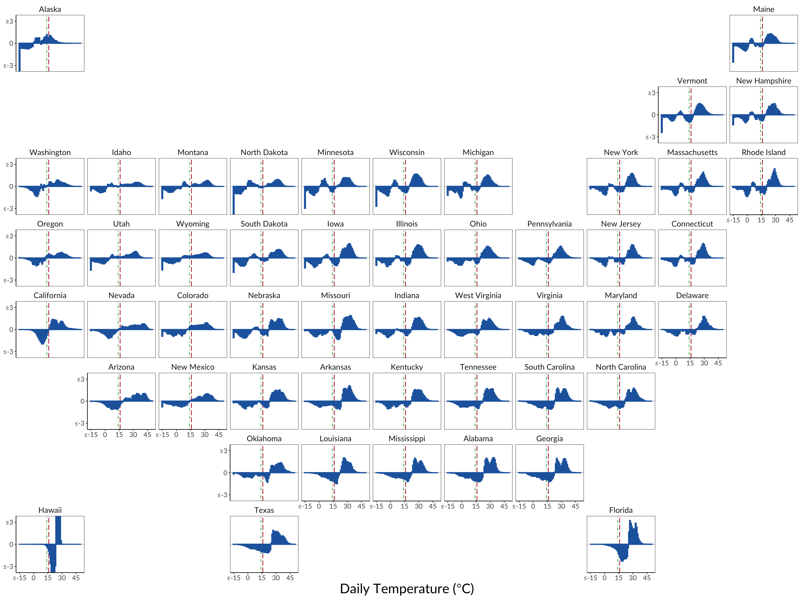

<left>

<!-- My research statement is available upon request.  -->

<h1 style="font-size: 40px;">Working Papers</h1>
 

<left class="flex-container">
<left>  </left>
<right> **Market Adaptation to Climate Change in Dynamic Spatial Equilibrium**
(joint with Ivan Rudik, Gary Lyn, Ariel Ortiz-Bobea)   
  <em>**R&R, Journal of Political Economy: Macroeconomics**</em>  
  **Research Question**: What are the welfare effects of general equilibrium adaptation via trade, migration, and capital accumulation in response to   climate change?  
  **Methodological Contributions**: (1) Model-consistent estimating equations to identify climate impacts on productivity and amenities from temperature shocks; (2) Quantitative decomposition of general equilibrium adaptation channels (trade, migration, industry switching, capital accumulation) to shocks in fundamentals in a dynamic spatial model
</right>

<!--  
<font-size:40px>
<h1 style="font-size: 40px;">Selected Work in Progress</h1>

The Geography and Spatial Networks of Innovation -->

<!-- The Dynamic Propagation of Productivity Shocks (with Zebang Xu)

The Determinants of Spatial Autocorrelation (with Shoki Kusaka, Sabrina Peng, and Christina Qiu)

The Geography of Technology Vintages (with Bernardo Ribeiro)  -->

