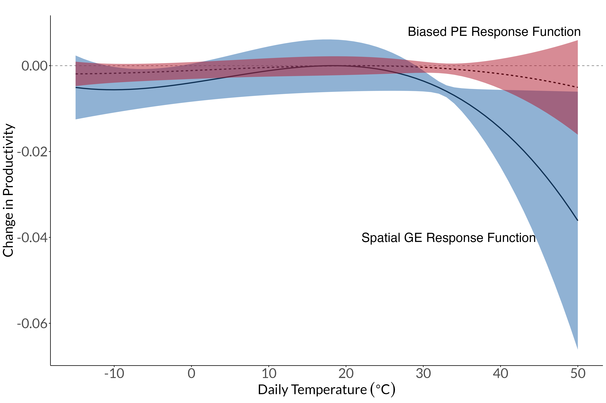

<left>

<!-- My research statement is available upon request.  -->

# Working Papers

<left class="flex-container">
<left>  </left>
<right> **Market Adaptation to Climate Change in Dynamic Spatial Equilibrium**
(joint with Ivan Rudik, Gary Lyn, Ariel Ortiz-Bobea)  
  **Research Question**: What are the welfare effects of general equilibrium adaptation via trade, migration, and capital accumulation in response to climate change?  
  **Methodological Contributions**: (1) Model-consistent estimating equations to identify climate impacts on productivity and amenities from temperature shocks; (2) Quantitative decomposition of general equilibrium adaptation channels (trade, migration, industry switching, capital accumulation) to shocks in fundamentals in a dynamic spatial model
</right>

 

# Work in Progress

The Geography and Spatial Networks of Innovation in the United States (Job Market Paper)

The Dynamic Propagation of Productivity Shocks (with Zebang Xu)

Climate Adaptation Portfolios (with Derek Lemoine, Antonia Marcheva, Ivan Rudik)

