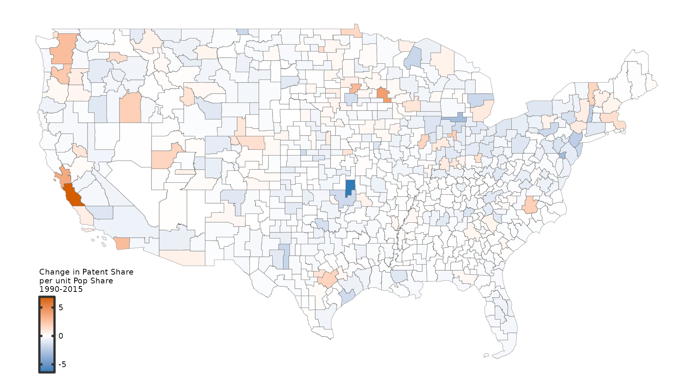

<left>

My research statement is available on request.

<h1 style="font-size: 40px;">Working Papers</h1>
 

<left class="flex-container">
<left>  </left>
<right> <a href="Weiliang_Tan_JMP.pdf" target="_blank">**The Geography of Innovation in the United States**</a>
  (Job Market Paper)   
   **Research Question**: What drives the rising spatial concentration of innovation from 1990 and what are the aggregate consequences? 
   **Methodological Contributions**:  
(1) Introduce endogenous, directed, and microfounded innovation in a dynamic spatial model; 
(2) Decompose the welfare impacts from shocks to fundamentals into transitory and long-run growth components
</right>

 
<left class="flex-container">
<left>  </left>
<right> <a href="https://osf.io/preprints/socarxiv/usghb" target="_blank">**The Economic Effects of Climate Change in Dynamic Spatial Equilibrium**</a>
  (joint with Ivan Rudik, Gary Lyn, Ariel Ortiz-Bobea)   
   <em>**R&R, Journal of Political Economy: Macroeconomics**</em>  
  **Research Question**: What are the welfare effects of general equilibrium adaptation via trade, migration, and capital accumulation in response to   climate change?  
  **Methodological Contributions**:  
(1) Model-consistent estimating equations to identify climate impacts on productivity and amenities from temperature shocks;  
(2) Quantitative decomposition of general equilibrium adaptation channels (trade, migration, industry switching, capital accumulation) to shocks in fundamentals in a dynamic spatial model
</right>

 
<font-size:40px>
<h1 style="font-size: 40px;">Work in Progress</h1>

 
<left class="flex-container">
<left>  </left>
<right> **The Geography of Technology Vintages** 
  (joint with Bernardo Ribeiro)  
   **Research Question**: Why are newer technology vintages concentrated  in big cities?
    **Methodological Contribution**: Introduce technology vintages in a   dynamic spatial model with endogenous and directed innovation
</right>

 
<left class="flex-container">
<left>  </left>
<right> **The Geography and Spatial Networks of Innovation**
     **Research Question**: What drives the rising intensity of cross-region   coinventor networks and what are the aggregate implications?
<!--     **Intended Methodological Contribution**: Introduce field-specific   expertise in a dynamic spatial model with endogenous and directed  innovation -->
</right>

<!-- The Dynamic Propagation of Productivity Shocks (with Zebang Xu) -->

