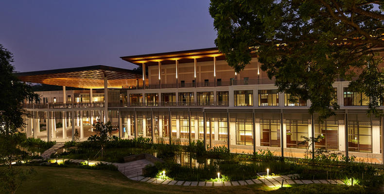

 <h1>Undergraduate Education: Yale-NUS College</h1> 

I graduated summa cum laude from Yale-NUS College in Singapore in 2018. I am extremely grateful to have had access to a leading liberal arts education with faculty from National University of Singapore, Yale, and other leading institutions at a highly affordable cost. 
The common curriculum with many compulsory courses in philosophy, history, literature, and modern social thought helped me develop basic writing and critical thinking skills (though personal limitations remain as constraints), that complemented the standard basic math and economics courses in regular undergraduate economics programs.

At Yale-NUS I led the main student environmental group. Our projects included developing an environmental accelerator workshop for over 100 high school students over three iterations, organizing a conference that brought together over 200 stakeholders in environmental activism in Singapore, and enacting sustainability-related changes for campus activities and in our dining hall.

In Spring 2017, I was a visiting student at Yale University. 

